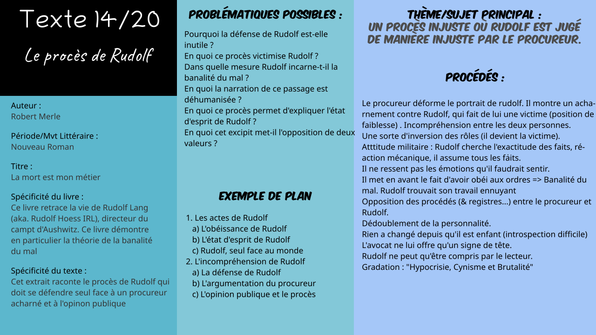

# Txt1 : Vous faites voir les os de *Paul Scarron*

*Logan Tann* - [Retour au menu](../)

**Plan vu en classe :**

1. Un contre-blason
   * Un portrait contradictoire
   * Un humour cruel
   * Une violente laideur
2. Une haine sans borne
   * Une véritable c
   * Une description hyperbolique
   * La déshumanisation d'Hélène

__Problématique choisie__ : Comment l'auteur retranscrit-il son ressentiment ?

## Éléments sans rapport avec le plan vu en classe

* 

## I\ Un contre-blason

### a) Un portrait contradictoire

* 

### b) Un humour cruel

* 

### c) Une violente laideur

* 

## II\ Une haine sans borne

### a) Une véritable c

* 

### b) Une description hyperbolique

- 

### c) La déshumanisation d'Hélène

* 

## Éléments supplémentaires

__Introduction__ : 

> 

__Conclusion__ :

> Paul Scarron exprime son ressentiment envers une femme dont la bouche l'incommode. Il a, pour cela, choisi la forme du sonnet (la forme la plus noble pour chanter l'amour) ce qui est paradoxalement judicieux pour critiquer et déclarer sa haine à cette femme. Paul scarron va ainsi à l'encontre des convenances artistiques de l'époque en choisissant le thème de contre-blason.
> Nous pouvons également remarquer que le rire insupportable d'Hélène peut rappeler à bien des égards le rire provoqué par la bouche déformée de Gwynplaine, personnage principal de «L'homme qui rit» de Victor Hugo.

__Problématiques possibles__ : 

> * En quoi ce poème peut-il être considéré comme un contre-blason ?
> * En quoi ce poème est-il comique ?
> * Quelle vision de la femme propose l'auteur dans ce sonnet.
> * En quoi le poète, à travers la description de la femme, forme-t-il un portrait péjoratif de cette dernière ?
> * En quoi la laideur d'Hélène est-elle soulignée dans ce poème ?

__Schéma Bilan__ : 

[Fichier Vectoriel (pour modification informatique)](txt14.svg)

Fichier PNG : 

